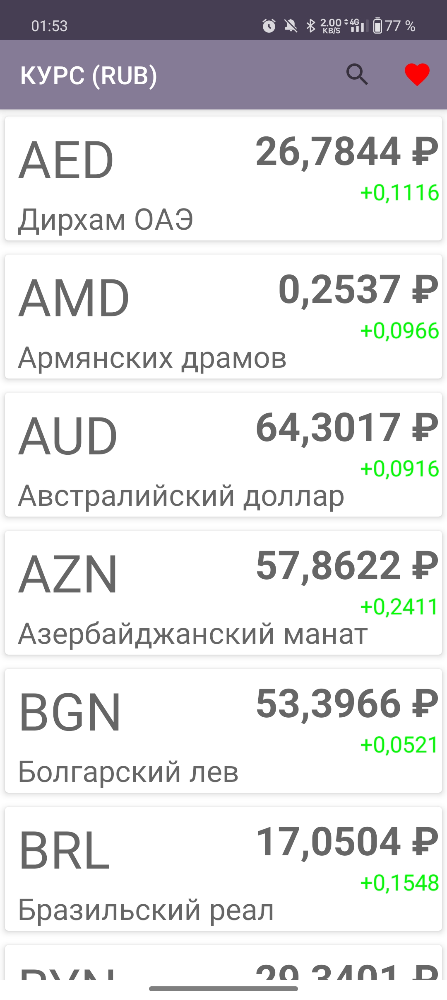
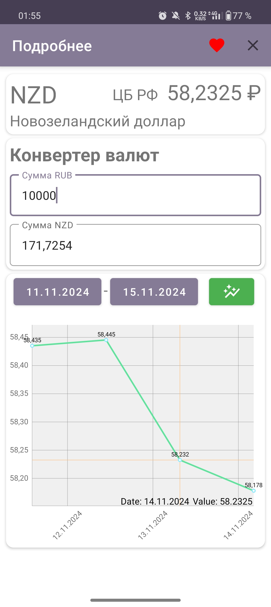
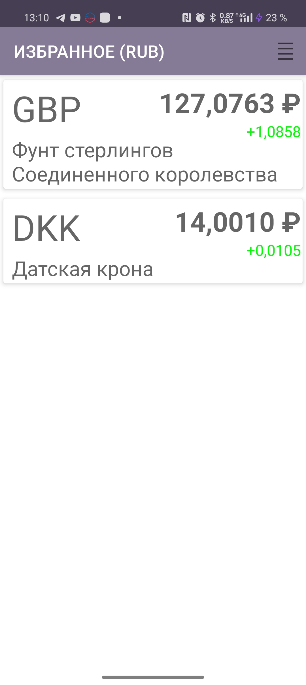

# ExchangeRates

ExchangeRates — это Android-приложение для просмотра и анализа курсов валют в реальном времени. Оно позволяет пользователям получать актуальные данные о курсах валют, конвертировать валюты и следить за динамикой их изменения с помощью удобного интерфейса и графиков.

## 📱 Скриншоты

### Главный экран
 

### Экран детализации валюты
 

### Избранное
 

## 🚀 Основные возможности

- **Просмотр курсов валют**: отображение актуальных курсов валют с изменением за сутки.
- **Избранные валюты**: возможность добавлять часто используемые валюты в избранное для быстрого доступа.
- **Конвертер валют**: преобразование суммы из RUB в выбранную валюту.
- **Графики изменений**: визуализация динамики курса валют за определённый период.
- **Локальная база данных**: хранение данных о избранных валютах.

## ⚙️ Технологический стек

- **Jetpack Navigation** — управление навигацией между фрагментами.
- **Retrofit** — работа с API для получения данных о курсах валют.
- **Room** — локальное хранилище для избранных валют.
- **MPAndroidChart** — визуализация данных в виде графиков.
- **OkHttp** — HTTP-клиент для работы с сетью.
- **Kotlin Coroutines** — выполнение асинхронных задач.

## 🗂 Структура проекта

- **CurrencyFragment** — экран со списком всех валют и их текущими курсами.
- **FavoriteFragment** — экран с избранными валютами.
- **DetailFragment** — экран детализации курса валюты, включая график изменений и конвертер.
- **Repository** — реализация слоя данных для работы с API и локальной базой.
- **Database** — слой локальной базы данных на основе Room.

## 📦 Используемые зависимости

- `androidx-core-ktx` — расширения KTX для Android.
- `androidx-lifecycle` — управление жизненным циклом компонентов.
- `androidx-navigation` — компоненты для навигации между фрагментами.
- `retrofit2` — для взаимодействия с API.
- `okhttp3` — HTTP-клиент.
- `kotlinx-coroutines` — для асинхронных операций.
- `androidx-room` — локальная база данных.
- `mpandroidchart` — библиотека для создания графиков.

## 🧩 Пример использования

1. Откройте приложение и просмотрите список актуальных курсов валют на главном экране.
2. Добавьте валюты в избранное, чтобы быстрее к ним обращаться.
3. Выберите любую валюту для просмотра подробной информации, графика изменений и выполнения конвертации.
